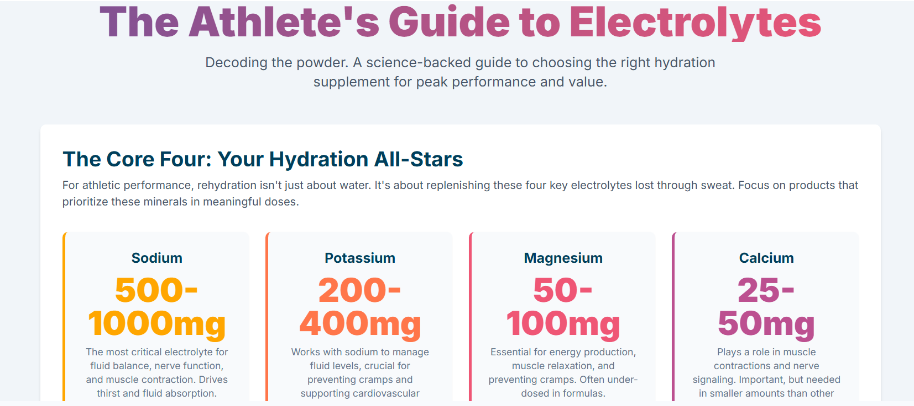

# Interactive Guide to Electrolyte Powders

This repository contains the source code for [The Athlete's Buying Guide to Electrolyte Powders](https://brandonml.github.io/electrolyte-guide-interactive/), an interactive, single-page web application.

The guide is designed to help athletes understand the science behind electrolyte supplements and make informed purchasing decisions. It features:

*   Information on the "Core Four" essential electrolytes.
*   Interactive charts comparing typical vs. optimal dosages.
*   Guidance on bioavailability and other ingredients.
*   A "Custom Performance Fuel Generator" that uses the Google Gemini API to provide personalized recommendations based on user input.

## View the Live Guide

You can view and interact with the live guide on [GitHub Pages](https://brandonml.github.io/electrolyte-guide-interactive/).